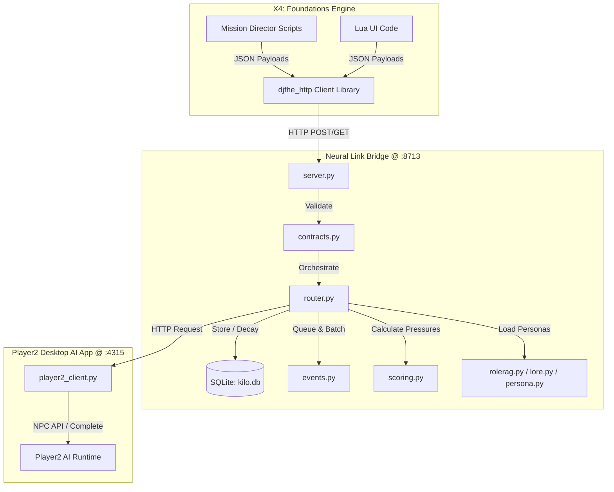

# X4 Neural Link

[](https://www.egosoft.com/)
[](https://www.python.org/)
[](https://github.com/)
[](https://github.com/)

**X4 Neural Link** is a high-performance, local AI integration bridge for *X4: Foundations*. It establishes a plug-and-play localhost tunnel between X4 mods (via the `djfhe_http` client library) and the **Player2** desktop AI runtime.

Its primary role is architectural: providing the durable state, memory, queuing, and communication substrate necessary for AI-driven NPC reasoning. It is designed to be **decoupled, narrow, and performant**—delegating gameplay logic, faction diplomacy rules, and specific UI elements to extension mods (like `x4_ai_influence`).

---

## 1. Architecture Overview

X4 Neural Link operates as the middle layer of a three-tier system:



---

## 2. Directory & Module Breakdown

### Core Modules (`bridge/`):
* **`server.py`**: A standard-library-based HTTP server running on `127.0.0.1:8713`. It exposes endpoints for mod integration, memory querying, event queuing, and diagnostics.
* **`contracts.py`**: Defensively validates incoming request/response JSON envelopes. Coordinates channels (such as `npc`) and validates routing actions.
* **`router.py`**: The central coordinator. It manages the flow of data between the event queue, memory storage, scoring engines, and the Player2 client. It also handles strategic review resolutions (`_resolve_events`).
* **`player2_client.py`**: Adapter communicating with the Player2 desktop AI app (`127.0.0.1:4315`) using its structured **NPC API** (`spawn`/`chat`/`kill`) and raw chat completion fallbacks.
* **`memory.py`**: Manages a save-scoped SQLite database (`kilo.db`). It tracks NPC stats, relationships, factions, raw turn logs, and condensed facts.
* **`events.py`**: A thread-safe `EventQueue` implementing batched, rate-limited execution and backpressure control to prevent spamming the LLM with events.
* **`scoring.py`**: Executes deterministic pressure scoring based on in-game economic, military, and diplomatic state changes.
* **`persona.py`**, **`lore.py`**, & **`rolerag.py`**: System for generating rich context prompts using Role RAG (Role Retrieval-Augmented Generation) and static lore.
* **`telemetry.py`**: Logs requests, server health metrics, and event histories, feeding the live dashboard.
* **`catdat.py`**: Parses X4 `.cat`/`.dat` game packages directly from the Python layer to read raw xml files on the fly.

---

## 3. Core Mechanics

### 🧠 4-Stage Stateful Memory Model
Memory in `x4_neural_link` is segmented and optimized to prevent prompt bloat while retaining critical context:
1. **Raw Turns**: Complete log of recent interactions.
2. **Fact Condensation**: Raw turns are periodically summarized into distinct `facts` (categorized as *core*, *significant*, or *routine*).
3. **Fact Decay**: Over time, routine facts decay and are deleted. Significant facts are gradually condensed.
4. **Verbatim Core Survival**: High-priority facts (e.g., declarations of war, player alliance oaths, deaths of main characters) bypass decay entirely and survive verbatim forever.
5. **Rolling Gist**: A dynamically updated, high-level summary of the NPC's history.

> [!IMPORTANT]
> **Save Scoping:** All database entries are keyed by `save_id`. When you switch saves in X4, the bridge automatically isolates memory contexts, preventing bleeding or corruption across playthroughs.

### 📊 Bounded Deterministic Scoring
To ensure robust, exploit-free gameplay, decisions are not made by raw LLM choice alone. 
1. The bridge deterministically evaluates factors like military pressure, losses, logistics stress, and economic delta to calculate pressure scores:
   $$\text{Pressure Score} = 0.30 \cdot \text{military} + 0.20 \cdot \text{economic} + 0.15 \cdot \text{recent\_losses} + 0.10 \cdot \text{logistics} + 0.10 \cdot \text{affinity\_penalty} \dots$$
2. The LLM acts strictly as a **decision selector** and **narrator** choosing among *legal* options bounded by the current pressure score.
3. The deterministic validator whitelists the action before passing it back to X4 to ensure stability.

---

## 4. Installation & Getting Started

### Prerequisites
1. **Python 3.10+** (must be added to your system `PATH`).
2. **Player2 Desktop AI app** (configured and running locally).
3. **X4 Foundations** with the **djfhe_http** client extension installed.

### Launching the Bridge

#### Development Mode (Live Watch & Auto-Reload)
Run this mode during development. The script compile-gates your code and automatically restarts the bridge whenever you edit files in `bridge/` or `config/`. If a compile error occurs, it keeps the previous version running:
```powershell
# Double-click the file or run via PowerShell:
.\Deploy-And-Restart.ps1
```

#### Production Mode (One-Shot Startup)
Starts the bridge server instantly in the background without watching files:
```powershell
# Double-click the file or run via PowerShell:
.\Start-Neural-Link.ps1
```

---

## 5. Endpoints & Verification

### Default Port Mappings:
* **Neural Link Bridge**: `http://127.0.0.1:8713` (Dashboard: `/dashboard`)
* **Player2 AI App**: `http://127.0.0.1:4315` (API docs: `/docs`)

### Basic Diagnostics
Verify the bridge is up and running by calling the health endpoint:
```powershell
Invoke-RestMethod -Uri "http://127.0.0.1:8713/health"
```

### Self-Tests & Stress Tests
You can verify the memory module, queue backpressure, and model integration by running these built-in test paths:
* **Memory Integrity (13/13 Checks):**
  `http://127.0.0.1:8713/api/memory/selftest`
* **Performance Stress Test (e.g., 10 NPCs, 100 turns):**
  `http://127.0.0.1:8713/api/memory/stresstest?npcs=10&turns=100`
* **Smoke Testing:**
  Run the automated smoke test script to validate basic bridge functionality:
  ```powershell
  python tests/smoke_bridge.py
  ```

---

## 6. Developer Gotchas

> [!WARNING]
> **Sandbox Mount Truncation:** Freshly edited files in your editor can sometimes appear truncated inside container sandboxes. Always trust host-side diagnostics. The `Deploy-And-Restart.ps1` script is run host-side and compile-gates safely.

> [!CAUTION]
> **Player2 Chat Budget:** Sending raw chat completions (`/v1/chat/completions`) with a small `max_tokens` limit on reasoning models can result in empty responses (as the model burns the budget on internal reasoning). Always utilize the custom NPC API (`player2_client.py` -> `npc_complete()`) which handles retry limits and token padding automatically.
