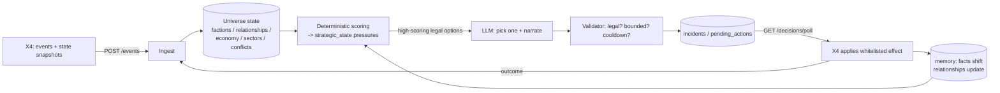

# X4 AI Influence — Blueprint 3: The Influence Engine

> Supersedes the "let the LLM decide" mental model in Blueprints 1–2. Those defined *what* the mod feels like and *what* we store. This one defines the **engine that turns stored state into game-state influence** — and it is the realization that makes the whole mod dramatically easier to build.

---

## 0. The thesis — why this changes everything

The hard version of this mod is: *"a large language model controls a galaxy and never breaks the game."* That is nearly impossible — LLMs are unreliable, can't be balanced, and can't be trusted with state.

The realization is that **we never actually needed that.** Bannerlord's AI Influence — and every robust game AI — does not let the model decide. It computes the decision with **deterministic math**, then uses the LLM only to **choose among already-legal options and explain itself**. Reframe the LLM from *authority* to *bounded chooser + narrator*, and every impossible part of this project becomes a tractable one:

| The "impossible" part | What it actually becomes |
|---|---|
| An AI that controls the galaxy correctly | A **weighted-sum score** over numbers we already track |
| An AI that never makes illegal/game-breaking moves | A **finite whitelist of N action types** + a deterministic validator |
| An AI that's reliable | Deterministic core; the LLM only flavors it, and has a **rule-based fallback** if it's offline |
| "We need to model the whole universe" | We store **meaning**, not the simulation — X4 already runs the universe |
| A huge new system | Mostly **wiring pieces we've already built** (bridge, memory, event queue, NPC API, dashboard) |

So the mod is not "build a galaxy-brain." It is: **facts in → score the situation → let the LLM pick a legal move and narrate it → validate → X4 applies the effect → record the outcome.** A clean, testable pipeline where the intelligence is swappable and the mechanics are deterministic. That is buildable.

---

## 1. The closed loop



The loop never stops: an outcome becomes the next event, which re-scores the situation, which drives the next decision. **That feedback is the "alive" feeling** — factions remember what you did and escalate or de-escalate accordingly.

Crucially, the loop runs on a **slow, scheduled cadence** (a *strategic review* every ~10–60s for hot situations, minutes for broad diplomacy) — **never per game tick**. We already built that scheduler: it's the event queue's green-light worker.

---

## 2. The three stages

### Stage 1 — Deterministic scoring (no LLM)
From the stored universe state, compute per-faction **pressure aggregates** and, for each candidate (faction → target, action) pair, a score:

```
score(faction, target, action) =
    0.30 * military_pressure
  + 0.20 * economic_pressure
  + 0.15 * recent_losses
  + 0.10 * logistics_stress
  + 0.10 * (-hidden_affinity(faction, target))
  + 0.10 * salient_memory_weight(faction, target)
  + 0.05 * player_alignment(faction, target)
  - 0.40 * cooldown_active(faction, target, action_class)
```

Pressures are derived from data we already plan to store: `recent_losses`/`military_pressure` from `conflicts` + loss aggregation; `economic_pressure` from `economy`/shortages; `hidden_affinity`/memory from `relationships` + `facts`. The weights live in config and are **tunable per performance profile** (Potato/Normal/High/Experimental).

The output of Stage 1 is a small ranked list of **legal, high-scoring options** — e.g. for Argon under heavy attrition and a hull-parts shortage: `[escalate_pressure(Teladi), request_supply(player), defensive_stance, ceasefire_feeler(Split)]`.

### Stage 2 — LLM picks one + narrates (bounded)
The LLM receives only: the faction persona, a compressed situation summary, the **ranked legal options**, and the top relevant memories. It returns:

```json
{
  "choice": "escalate_pressure",
  "target": "teladi",
  "confidence": 0.78,
  "narrative": "Teladi hoarding of refined metals while our fleets bleed is no longer tolerable. We will make the cost of their neutrality higher than the cost of supplying us."
}
```

The LLM **cannot invent an action** — it can only pick from the list (or decline → no-op). All it adds is *judgment between close options* and the *in-world explanation*. That's the part LLMs are actually good at, and the only part we trust them with.

### Stage 3 — Validate → X4 applies (deterministic)
The validator re-checks the chosen option against hard rules (still legal? within numeric bounds? player-confirmation required? cooldown clear? idempotent?) and emits an **incident / pending action**:

```json
{
  "action_type": "faction_pressure",
  "target": "teladi",
  "faction": "argon",
  "priority": 0.67,
  "cooldown_until": 1781870000,
  "narrative": "...",
  "effects": { "hidden_affinity_delta": -6, "military_pressure_delta": 8, "mission_offer": "protect_trade_lane" },
  "status": "pending"
}
```

X4 polls `incidents`, applies only the whitelisted `effects`, and acks the outcome — which re-enters the loop. **X4 is always the authority.** If validation fails, the action is dropped and (optionally) a dialogue-only line is shown.

---

## 3. Data model

Three layers, by lifetime:

**A. Live (never stored — read from X4 each turn):** current prices, ware stocks, real ship counts, live ownership, player credits. X4 owns these; storing them = instantly stale.

**B. Durable substrate (stored, `save_id`-scoped) — the *meaning* X4 doesn't model:**
- `factions` (values, strategic_biases, current_goal, mood) · `npcs` (+ tier/authority/faction) — *built/partly built*
- `relationships` (subject, object, trust/fear/resentment/debt, standing) — *built (storage)*
- `agreements` (parties, type, terms, deadline, kept/broken)
- `economy` (per faction: importance, dependency, shortages, pacts, restrictions) + `player_market` (ware/sector → dominance, supplying_enemies)
- `sectors` (owner, contested, strategic_value)
- `conflicts` (a vs b, intensity, cause) + loss aggregation
- `world_events` (persistent, typed history) · `facts`/`turns` (memory) — *built*

**C. Decision layer (the engine's working memory) — the new, central piece:**
- **`strategic_state`** — per faction: `military_pressure, economic_pressure, logistics_stress, recent_losses, territorial_pressure, piracy_pressure, player_alignment`, updated_at. *Derived* from layer B each review. **This is where economy/military/territory become a cause of action.**
- **`incidents` / `pending_actions`** — the AI's proposed changes (`action_type, target, faction, confidence, priority, cooldown_until, narrative, effects_json, status`). **This is the action whitelist made concrete** — the output X4 consumes.

The substrate feeds the scorer; the scorer writes `strategic_state`; the engine writes `incidents`; X4 drains `incidents` and the outcome updates the substrate. One cohesive per-save database.

---

## 4. The action whitelist

A finite, versioned set — implement it once and the AI can only ever do these. Phased (disabled-by-default for the risky ones):

- **MVP:** `dialogue_only`, `memory_update`, `logbook_entry`, `relation_change_limited`, `credit_transfer_limited`, `accept_offer`, `reject_offer`.
- **Phase 2:** `trade_offer`, `promise_record`, `temporary_diplomatic_flag`, `mission_offer`, `faction_bulletin`.
- **Phase 3+:** `intel_share`, `contract_offer`, `sector_warning`, `faction_alert`, `resource_request`, `ceasefire_pressure`.
- **Experimental (off by default):** `faction_relation_shift`, `fleet_priority_suggestion`, `trade_restriction`, `multi_faction_diplomatic_result`.

Every action carries numeric bounds, a cooldown, an authority requirement (which NPC tier may propose it), and a confirmation flag. The validator enforces all of it. **Adding intelligence = adding an action type + its bounds + its X4 executor.** That's a finite, schedulable task list — not an open-ended AI problem.

---

## 5. The strategic-review scheduler (already built)

Our `EventQueue` green-light worker **is** the review scheduler. Today it flushes a batch of events to a summarizer. Repurposed, each cycle it:
1. pulls the events/state deltas since last review,
2. updates `relationships` / `economy` / `strategic_state` (deterministic),
3. runs Stage-1 scoring to get ranked legal options,
4. (if a candidate clears threshold) runs Stage-2 LLM choice + Stage-3 validation,
5. writes an `incident`.

Priority preempt (importance-5 events: a capital-ship loss, a sector falling) jumps the queue — exactly as built. Backpressure (single drain lane) means event storms never thrash. **The scheduler, batching, backpressure, and dashboard are done; we're changing what one function does inside it.**

---

## 6. Deterministic fallback (the safety net that also makes it easy)

Because Stage 1 is pure math, the mod **works with the LLM turned off**: a faction under high military pressure and low logistics just auto-selects `defensive_stance`; a critical shortage auto-emits `resource_request`. The LLM, when present, only improves *which* close option is chosen and adds narrative. This means:
- development and testing don't need the LLM (free, fast, deterministic),
- a Player2 outage degrades gracefully instead of breaking,
- balance is owned by code we can unit-test, not by prompt-wrangling.

This single property — *the game-affecting logic is deterministic and the LLM is optional flavor* — is the biggest reason the mod is now realistic.

---

## 7. What's already built (so the gap is small)

| Engine piece | Status |
|---|---|
| Bridge transport (HTTP, contracts, telemetry, dashboard) | ✅ done |
| Player2 LLM access via NPC API (clean replies) | ✅ done |
| Memory: condensation, decay, CORE-verbatim, save-scoped, reset/index | ✅ done |
| NPC identity + X4 stats | ✅ done |
| Strategic-review scheduler (event queue + green light + backpressure + priority) | ✅ done (repurpose) |
| `factions`, `relationships` tables | ◐ storage built; endpoints next |
| `strategic_state` + scoring core | ❌ next |
| `incidents`/`pending_actions` + validator (the whitelist) | ❌ next |
| `economy`, `sectors`, `conflicts`, `agreements` (feed pressures) | ❌ scoped |
| X4-side mod (POST events, poll incidents) | ❌ not started (separate extension) |

The remaining bridge work is: two decision tables, one scoring function, one validator, and rewiring the worker we already have. The substrate tables are mechanical. That's weeks of focused work, not an open research problem.

---

## 8. Build phases

1. **Expose `relationships` + `factions`** (endpoints + dashboard readout). Methods exist.
2. **`strategic_state` + scoring core** — the deterministic pressures + weighted score, fully unit-testable with fixtures (no LLM).
3. **`incidents`/`pending_actions` + validator** — the action whitelist (MVP set) + legality/bounds/cooldown/idempotency checks. Dashboard shows proposed actions.
4. **Repurpose the review worker** — wire score → bounded-LLM choice → validate → incident. Demo: feed events, watch the score rise, watch the AI choose + narrate + emit a validated incident on the dashboard.
5. **Feed pressures** from `economy`/`player_market`, `sectors`, `conflicts`, `agreements`.
6. **Persistent `world_events`**; outcome write-back closes the loop.
7. **X4-side extension** (separate): `djfhe_http` collector POSTs events + polls `incidents`, applies whitelisted effects. Narrative-first MVP (bulletins/logbook/missions) before relation/credit writes.

Each phase is independently demoable in our headless setup before the game is ever involved.

---

## 9. One-paragraph summary

X4 already simulates the universe. We store its *political and economic meaning* (relationships, debts, deals, pressures), score every faction's situation with simple deterministic math, let the LLM pick among the *already-legal* high-scoring moves and explain them in character, validate the choice against a finite action whitelist, and let X4 apply only safe effects — then the outcome feeds back in. The LLM is a bounded chooser and narrator, never the authority; the mechanics are deterministic, testable, and degrade gracefully without it. Most of the plumbing — bridge, memory, the review scheduler — is already built. What's left is two decision tables, a scoring function, a validator, and wiring. That's why it suddenly feels easy: we stopped trying to build a galaxy-brain and started building a scoring engine with a storyteller bolted on.
